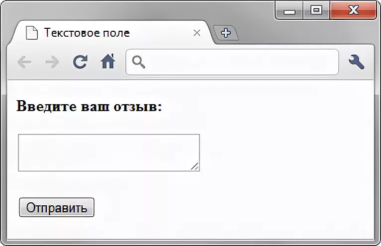

# Задание 1 
 Магазин принимает накопительные скидочные карты и при своем расчете учитывает количество баллов, по которому начисляет процент скидки: От 0 до 100 баллов - скидка 1% От 101 до 500 баллов - скидка 3 % От 500 до 2000 баллов - скидка 5% От 2001 баллов - скидка 10%

Задание: Составить такой набор тестовых данных для магазина (в формате количество баллов - ожидаемая скидка), при котором мы будем знать, что в соответствии со своими накопленными баллами покупатель получит верную скидку.

### Решение:
В данном случае, мы имеем четыре интервала баллов и соответствующие им проценты скидок:
1. От 0 до 100 баллов - скидка 1%
2. От 101 до 500 баллов - скидка 3%
3. От 501 до 2000 баллов - скидка 5%
4. От 2001 балла и выше - скидка 10%

Проверяю, что система правильно расчитывает скидку:

1. 0 баллов - ожидаемая скидка 0% (меньше первого интервала)
2. 50 баллов - ожидаемая скидка 1% (внутри первого интервала)
3. 150 баллов - ожидаемая скидка 3% (внутри второго интервала)
4. 600 баллов - ожидаемая скидка 5% (внутри третьего интервала)
5. 1800 баллов - ожидаемая скидка 5% (внутри третьего интервала)
6. 2500 баллов - ожидаемая скидка 10% (выше четвертого интервала)

- - - 

# Задание 2
 Наш сайт представлен на двух языках: русский (RU) и английский (EN). Из требований следует, что сайт будет открываться в браузерах Opera и Firefox, на операционных системах Windows 10 и Ubuntu 20.04, а также на устройствах с операционной системой Android 10 в браузере Chrome.

Задание: Укажите минимальный набор конфигураций (браузер, ОС, язык сайта), который вы бы использовали для тестирования данного сайта.
 
 ### Решение:
 Для тестирования данного сайта я бы использовала следующий минимальный набор конфигураций:

1. Браузер: Opera на Windows 10 (RU)
2. Браузер: Firefox на Ubuntu 20.04 (EN)
3. Браузер: Chrome на Android 10 (RU)

 
 (Также, для полноты тестирования, желательно проводить тестирование на других конфигурациях, чтобы убедиться в нормальной работе сайта на всех указанных платформах.)

- - -
# Задание 3

   Ответьте на вопросы:
- Какой категории ui-элементов относится данный элемент? (см. доп. материалы) 

- Приведите пример - ui-элемента из категории Input Controls.
- Является ли командная строка частью GUI?

### Решение:
####- Какой категории ui-элементов относится данный элемент?

1. Данный элемент относится к категории Navigation Controls.

####- Приведите пример - ui-элемента из категории Input Controls.
Примером ui-элемента из категории Input Controls может быть текстовое поле для ввода данных, например, поле для ввода текста или поле для ввода числа.
Пример:

#### - Является ли командная строка частью GUI?
Нет, командная строка не является частью GUI.
 GUI представляет собой способ взаимодействия пользователя с компьютером через графические элементы, такие как окна, кнопки, меню и т. д.
Консоль(КС) представляет собой текстовый интерфейс и пользователь взаимодействет вводит команды текстом.
Таким образом это разные взаимодействие с компьютером.

- - -
# Задание 4
 #### Какой тип мобильного приложения не имеет доступа к внутреннему функционалу смартфона, например пушам?
 Веб-приложения не имеют доступа к внутреннему функционалу смартфона, такому как пуши или доступ к контактам и.т.д.
 
  Веб-приложения работают в браузере и ограничены в своих возможностях по сравнению с  мобильными приложениями, которые могут получить доступ к различным функциям устройства через API.
